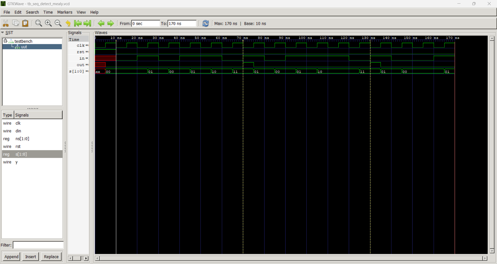
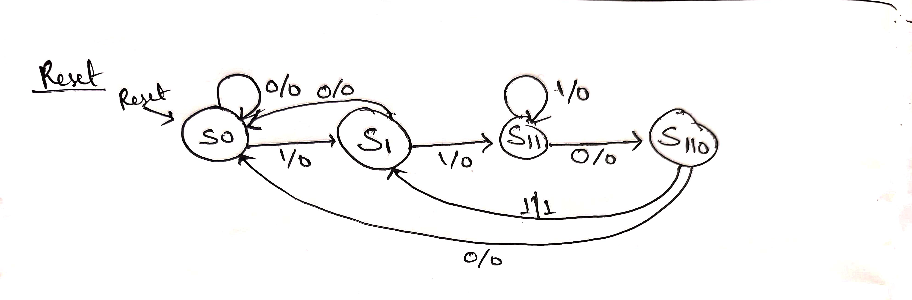

#Problem 1 — Mealy Overlapping 1101 Detector

##How to run:
  iverilog -o sim\sim.out tb_seq_detect_mealy.v seq_detect_mealy.v
  vvp sim.out
  gtkwave dump.vcd

Streams tested: 11011011101
Expected y pulses at the cycle completing bits #4, #7, #11 (1-indexed).
## waveform

