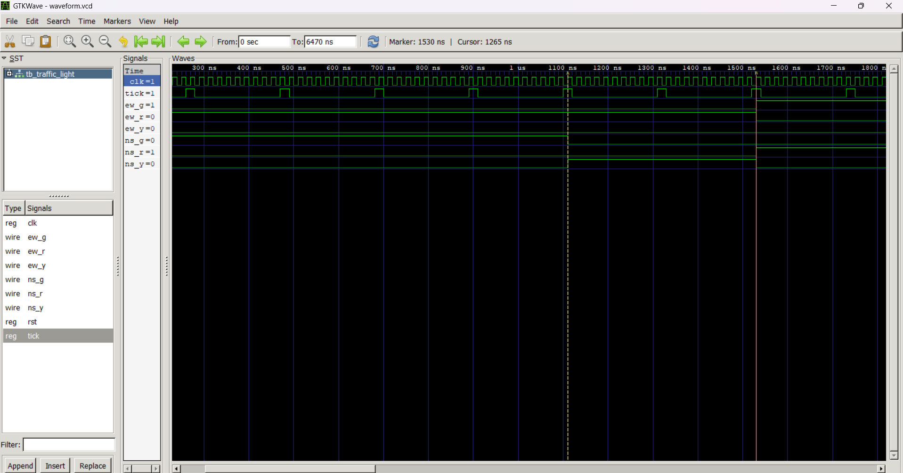

# Problem 2: Moore FSM Traffic Light Controller
tools **Icarus Verilog** and **GTKWave**


#### 1. Compile the Verilog Files

```bash
iverilog -o traffic_light_tb traffic_light.v tb_traffic_light.v
```
#### Run the Simulation
```bash
vvp traffic_light_tb
```
####  Visualize the Waveform
```bash
gtkwave waveform.vcd
```



